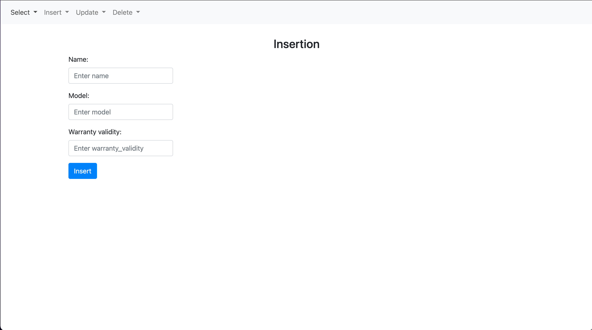
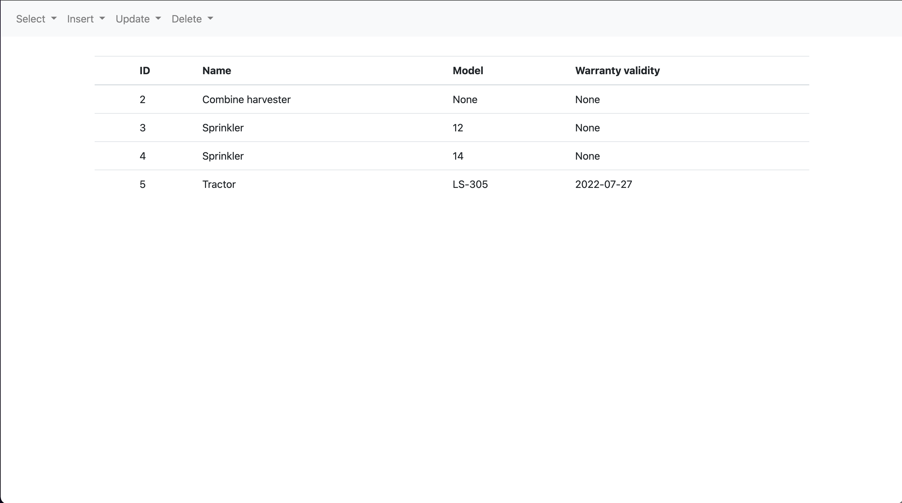

# World-Flower-Enterprise
## Goal of the project:
Application created as a project for a university that manages a database of a company dealing in the cultivation and sale of flowers and seeds.
## Technologies:
* Python 3.9.1 
* postgreSQL 14.0 
* Flask 2.0.2 
* psycopg2 
## Screenshots:

